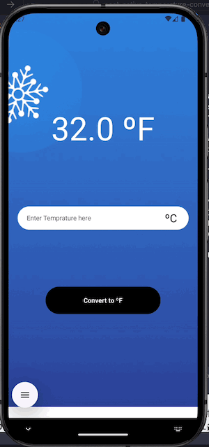

# react-native-temperature-convertor

A simple mobile app written using [React-Native](https://reactnative.dev/docs/getting-started) to convert the temperature from Celsius to Fahrenheit and vice versa.

This application is written using JavaScript and [TypeScript](https://www.w3schools.com/typescript/) with some [ES6](https://www.w3schools.com/js/js_es6.asp) arrow functions writing styles to make it work and understand easily. React-Native components and React APIs are used for UI and UX things. To initiate, run, and host the application on both Android and iOS devices, i use the [Expo](https://docs.expo.dev) framework.

Following are the concepts and components used in this application code:

## Concepts:

- JavaScript, Typescript, ES6.
- UI Comonents: Text, TextInput, View, SafeAreaView, TouchableOpacity.
- Styles, [Flex](https://reactnative.dev/docs/next/flexbox#flex).
- Custom Componets making and exporting
- [useState](https://react.dev/reference/react/useState) hook
- [useEffect](https://react.dev/reference/react/useEffect) hook

## How to setup:

To set up the environment for the project using Expo, follow the instructions [here](https://docs.expo.dev/get-started/set-up-your-environment). Make sure Node is installed to run the Expo, and commands like node -v, npm -v, and npx -v should return version values. If not, you can install Node via [HomeBrew](https://formulae.brew.sh/formula/node) as I am using macOS. For other OS you can check [here](https://nodejs.org/en/download/package-manager).

Make sure you have installed the iOS Simulator via Xcode and the Android virtual device via [Android Studio](https://developer.android.com/studio) or the Expo application installed on your real [iOS](https://apps.apple.com/in/app/expo-go/id982107779) or [Android](https://play.google.com/store/apps/details?id=host.exp.exponent&referrer=docs) device. After that, here are the commands to run in the terminal in the application folder path to make this app ready and running:

Install dependancies:

```bash
npm install
```

Run the application:

```bash
npx expo start
```

Follow the instructions to on console window to make the application run on simulators and real device via Expo.

## Demos

iOS App Demo:


Android App Demo:


## Authors

- [@gurjitdhiman](https://github.com/gurjitdhiman)

## License

[MIT](https://choosealicense.com/licenses/mit/)
